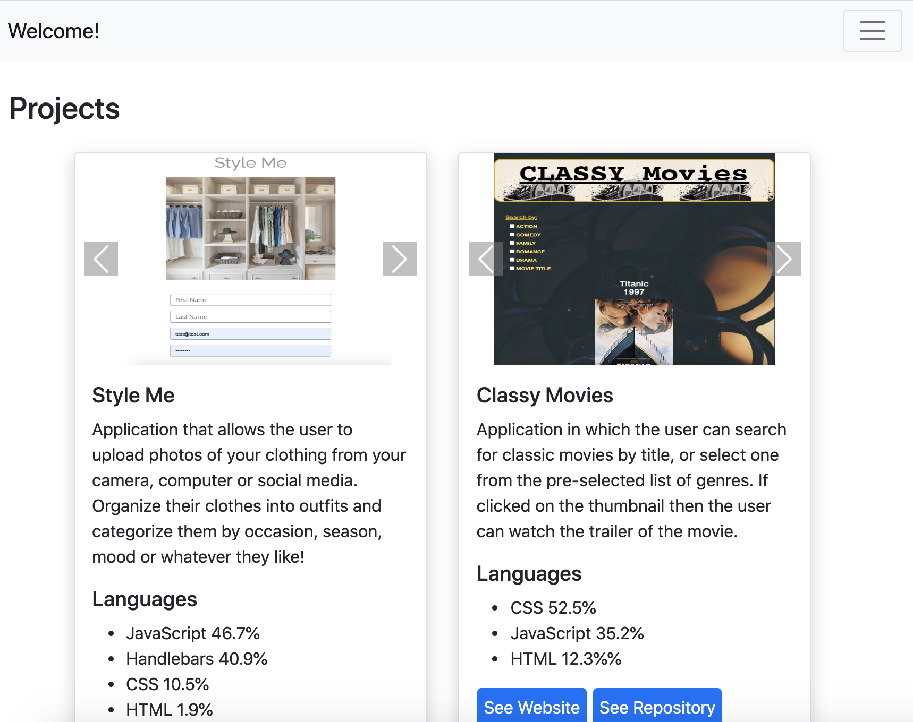

# Esteban's Portfolio

## User Story

As a student-developer, I want to create web applications that render well on a variety of devices and windows or screen sizes. Creating a mobile-first application or adding responsive design to an existing application ensures just that!

## Table of Content

* [Motivation](#motivation)
* [Description](#description)
* [Requirements](#requirements)
* [Screenshots](#screenshots)
* [Link to Page](#link-to-page)
* [Tools](#tools)
* [License](#License)

## Motivation

I want employers and other developers to know that I am able to create a mobile responsive portfolio. 

## Description

* Use Bootstrap CSS Framework to create a mobile responsive portfolio.
* Create the following files: index.html, portfolio.html and contact.html.
* Using Bootstrap, develop your portfolio site with the following items:

    1. A navbar
    2. A responsive layout
    3. Responsive images

* The Bootstrap portfolio should minimize the use of media queries.

## Requirements 

* Functional, deployed application.
* Navbar must be consistent on each page.
* Navbar on each page must contain links to Home/About, Contact, and Portfolio pages.
* All links must work.
* Must use semantic html.
* Each page must have valid and correct HTML. (use a validation service)
* Must contain your personalized information. (bio, name, images, links to social media, etc.)
* Must properly utilize Bootstrap components and grid system.

## Screenshots

## Link to Page

<https://esmendez90.github.io/esmendez90/>

## Tools

* Bootstrap CSS Framework <https://getbootstrap.com/docs/5.0/getting-started/introduction/>.
* Visual Studio Code <https://code.visualstudio.com>.
* Markup Validation Service <https://validator.w3.org/>.

## License

MIT

 
